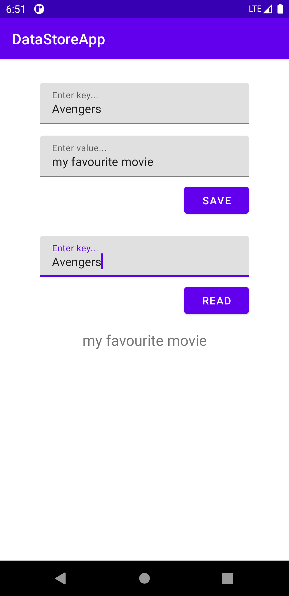

# DataStoreApp

### **Overview - About this project**
This is a simple project **Using DataStore** to replace SharedPreferences.

### 📷 How is this App
</img>
</img>


### 💻Technology
- [Kotlin](https://kotlinlang.org/)
- [Material](https://material.io/)

### Libraries

```bash
    implementation "androidx.datastore:datastore-preferences:1.0.0-alpha04"

    implementation 'org.jetbrains.kotlinx:kotlinx-coroutines-core:1.3.9'
    implementation 'org.jetbrains.kotlinx:kotlinx-coroutines-android:1.3.9'

    // Coroutine Lifecycle Scopes
    implementation "androidx.lifecycle:lifecycle-viewmodel-ktx:2.2.0"
    implementation "androidx.lifecycle:lifecycle-runtime-ktx:2.2.0"
```


### Donation
If this project help you reduce time to develop, you can buy me a cup of coffee :) 

<a href="https://www.buymeacoffee.com/gilsonjuniorpro" target="_blank">
    
</a>
